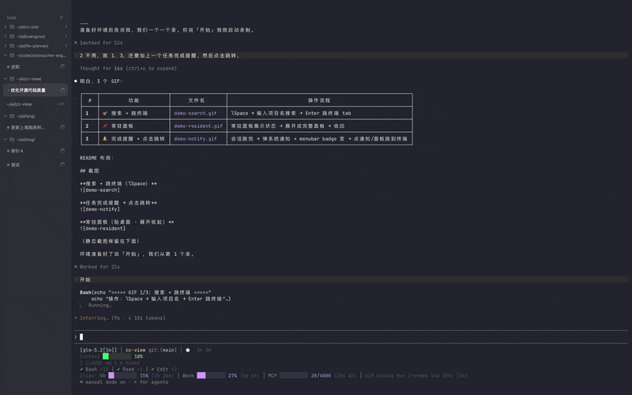
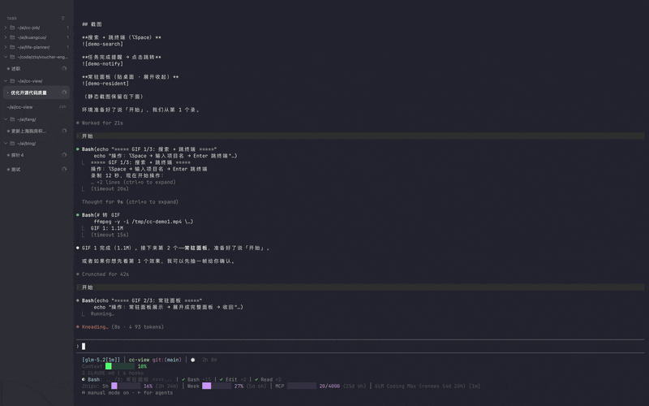
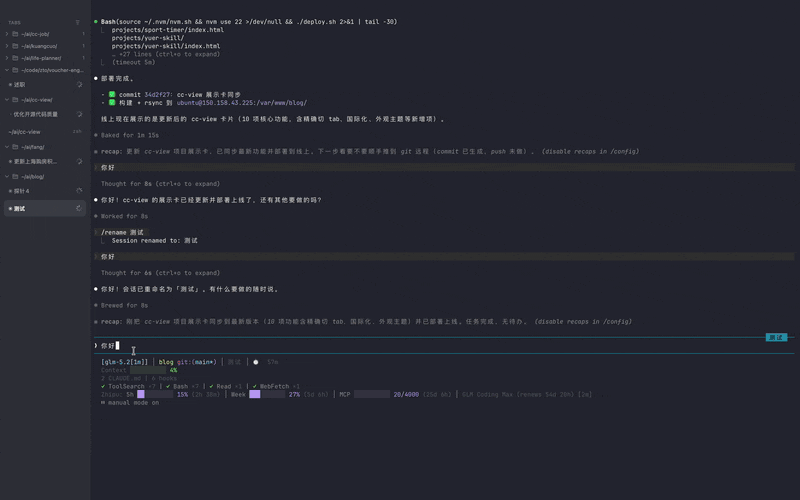
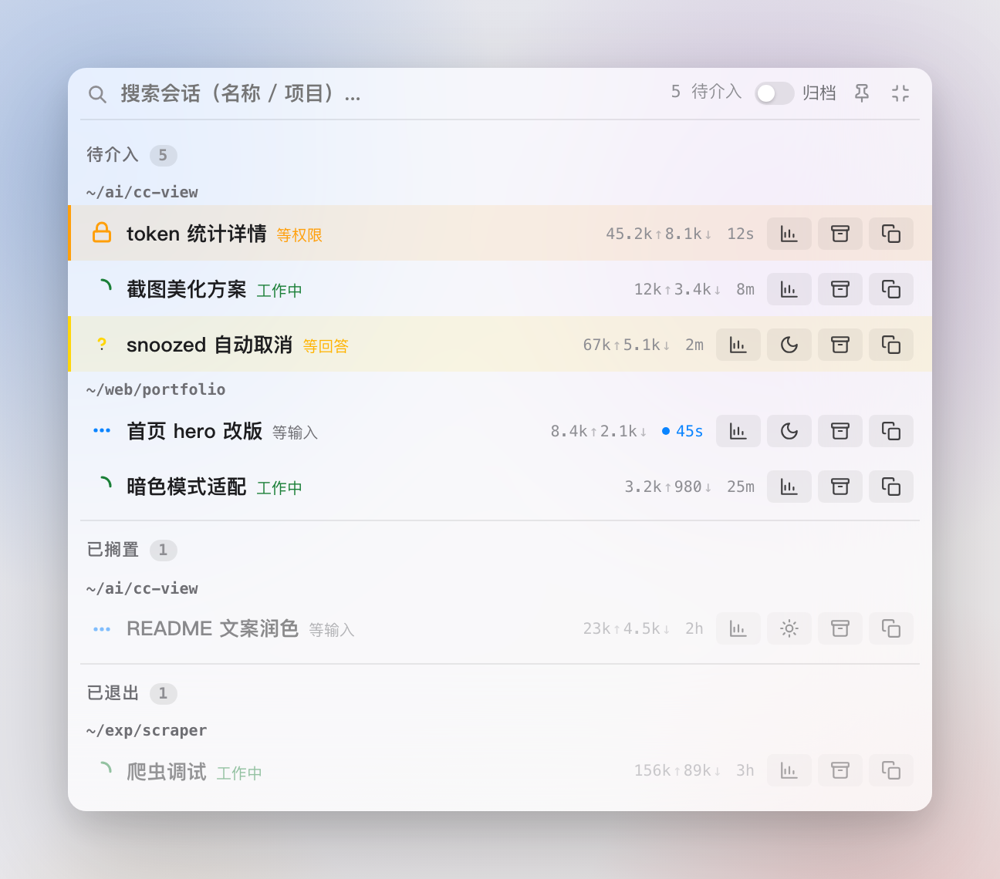
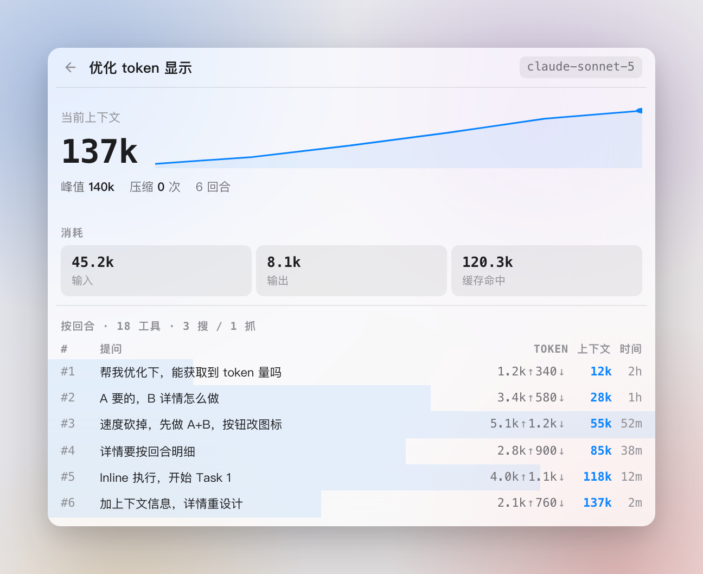
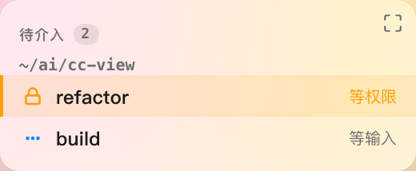
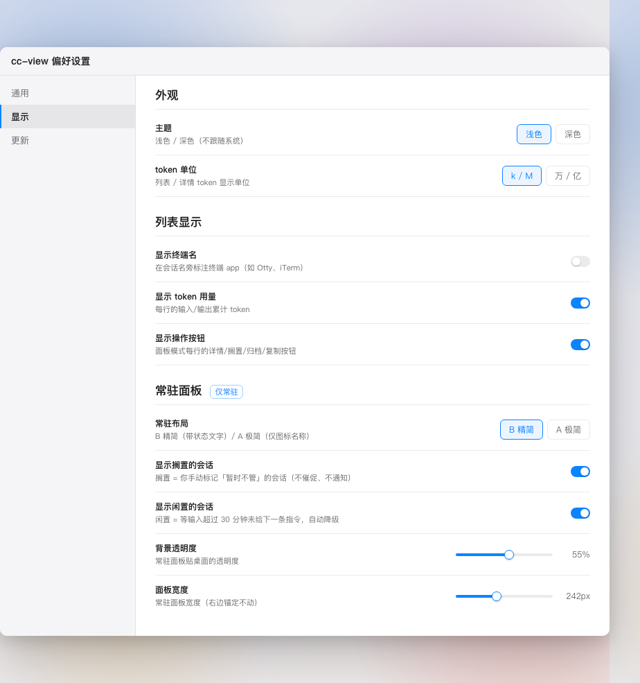

# cc-view

> Cross-terminal Claude Code session status overview · macOS menubar

English · [简体中文](README.md)

[](https://github.com/Ethanzyc/cc-view/releases)
[](#installation)
[](#installation)
[](https://tauri.app)
[](LICENSE)

When running multiple Claude Code terminal sessions in parallel, their status is scattered across tabs and windows — which one is working, which one is waiting for your reply / permission, which one is idle. You have to switch windows one by one. It's easy to miss a blockage: a Claude waiting 10 minutes for permission confirmation that you didn't notice just sits idle.

cc-view aggregates all sessions into **one menubar icon** (hover to see "N waiting · M working", turns orange + red badge when intervention needed) + **⌥Space command panel** (search / focus terminal / snooze / archive / copy ID, collapses on blur) + **always-on compact panel** (desktop-anchored, status color flash alerts) + system notifications — master all sessions without switching windows, jump to the one that needs attention.

**Click a session to jump directly to the correct terminal tab** — not just app-level activate (iTerm2 / Terminal / Otty match by TTY for precise tab targeting, Ghostty / cmux by cwd).

**Dual-source auto-update fallback** — GitHub primary, Gitee for China network fallback, auto-switches when GitHub is unreachable.

## Screenshots

**Search + Focus Terminal (⌥Space → type → Enter)**



**Resident Panel (desktop-anchored · expand/collapse)**



**Task Done Notification → Click to Jump**



---

**Command Panel (⌥Space) — multi-project multi-status + token column**



**Session Detail (click 📊 inline) — context curve + turn-by-turn breakdown**



**Resident Mode (desktop-anchored · flash alert on attention needed)**



**Preferences (VSCode style · toggle switches)**



## Features

### 🎛️ Command Panel (⌥Space)
- Global shortcut to show centered overlay with **search** (name / project) / **focus** (jump to terminal) / **snooze** / **archive** / **copy ID**
- Auto-collapse on blur; pin to keep open; position remembered, persists after drag
- Configurable list display: terminal name / token usage / action buttons each independently togglable (Preferences → Display)

### 🎯 Precise Terminal Tab Switching
- Click a session row to jump directly to the **correct terminal tab/window**, not just app-level activate
- **iTerm2 / Terminal.app / Otty**: TTY matching (`ps` to get controlling TTY → AppleScript traverse tabs/sessions for match)
- **Ghostty ≥ 1.3.0 / cmux**: OSC 7 marker precise match (write unique cwd marker to TTY → AppleScript match → restore). cmux is built on libghostty and inherits Ghostty's AppleScript model
- **Other terminals** (Warp / VSCode / IntelliJ / WezTerm / Alacritty / Kitty): app-level activate (no programmable API or extra config needed)
- Fullscreen Space switching: unified Dock icon click (only reliable method)

### 📌 Resident Mode
- Compact form of the same overlay — desktop-anchored always-on, no collapse on blur, adjustable background opacity (0–100%), **adjustable width** (drag right edge 140–480px, right-anchored, persists)
- **B Compact** (grouped + status text) / **A Minimal** (icon + name only) layouts, toggle snoozed / idle visibility
- **Flash alert on attention needed**: when a session transitions from "not needing attention" to "needs attention", the target row + entire frame pulse with status color 3 times (resident mode only, throttled)
- **Unread badge**: red dot when a session transitions to needing attention (unread-message style), clears on focus or when the session resumes processing — both resident + command panel
- One-click expand to full command panel, one-click collapse back

### 🎨 Appearance Theme
- Manual **Light / Dark** in Preferences, defaults to Light, **does not follow system**
- Vibrancy material optimized to `UnderWindowBackground`: clear text in dark mode, light mode opacity 0% no longer glaring white

### 📊 Token Stats & Context Detail
- Each row shows cumulative tokens (input↑ / output↓), see at a glance which session burns the most
- Click detail for session token breakdown: **current context** large number + sparkline growth curve + consumption triple (input / output / cache hit) + per-turn list (background progress bar + context column)
- Auto compact detection: significant context drop between adjacent turns (30%+) infers a compaction (**does not depend on `compact_boundary` marker**, works with new claude-code versions)
- Token unit configurable: **k/M** (international, default) or **万/亿** (Chinese), switch in Preferences

### 🔔 Menubar Aggregation + System Notifications
- Menubar icon tooltip "N waiting · M working / permission / reply"; turns orange + red badge when NeedsPermission / WaitingForReply
- System notification when a session enters "waiting for permission / waiting for input / needs attention" (distinguished by session name, can be disabled)

### 🗂️ Snooze & Archive
- **Snooze**: temporarily ignore (no nagging, no notifications); auto-unsnoozed when session gets new input (status update), bubbles back to attention
- **Archive**: collapse rarely-watched sessions (persistent, restorable)

### 💤 Idle Degradation
- Waiting for input over 30min auto-grays out + marks "Idle", all-idle projects sink to bottom; stale waiting-for-reply also grays out — don't steal attention

### ⚙️ Preferences & Auto-Update
- **VSCode style**: left category nav (General / Display / Update) + right setting rows, open from the menubar icon menu
- **Display** category: theme / token unit / **show terminal name** / **show token usage** / **show action buttons** / resident layout / snoozed / idle / opacity / panel width
- Unified **macOS toggle switches**; snooze / idle items with descriptions (snooze = manual pause, no nagging or notifications; idle = auto-degrade after 30min no input)
- Auto-check + download + install + restart via [tauri-plugin-updater](https://v2.tauri.app/plugin/updater/)
- **Dual-source fallback**: GitHub primary → Gitee for China network fallback (updater auto-fallbacks in order)

### 🌐 Internationalization
- Supports **Simplified Chinese** and **English**, auto-detects system language
- Switch in Preferences → General → Language (Follow system / 简体中文 / English)
- Menubar menu, tooltip, notifications all localized

## Shortcuts

| Shortcut | Action | Configurable |
| --- | --- | :---: |
| `⌥Space` | Toggle command panel | ✅ Changeable to `⌘⌥Space` / `⌃Space` / Disabled |
| `Enter` (in panel) | Focus selected session (jump to terminal) | — |
| Click / Enter session row | Focus that session | — |

## Installation

1. Download the latest [release dmg](https://github.com/Ethanzyc/cc-view/releases/latest): choose by CPU architecture — Apple Silicon (M-series) use `cc-view_<ver>_aarch64.dmg`, Intel use `cc-view_<ver>_x86_64.dmg`.
2. Open the dmg, drag cc-view to **Applications**.
3. Launch cc-view — an icon appears in the menubar (no dock icon normally), `⌥Space` to bring up the command panel.

### Gatekeeper "Cannot Verify" Prompt

cc-view is a personal open-source project, not Apple notarized (notarization requires $99/year Apple Developer Program). macOS Gatekeeper will block DMG-installed apps. To handle this:

1. **Double-click to open** → prompt "Apple cannot verify…" → click "Done" to close
2. **System Settings → Privacy & Security** → scroll to bottom → click "Open Anyway" → confirm
3. cc-view will **automatically remove the quarantine tag** on launch (v0.5.4+), subsequent launches won't show this prompt

> You can also run `xattr -dr com.apple.quarantine /Applications/cc-view.app` in Terminal — same effect.

> **Auto-update is not affected**: the built-in updater downloads apps without the quarantine tag, launching directly after update without Gatekeeper prompts. Only manual DMG installation triggers this.

**Requirements**: macOS 13+, Apple Silicon (aarch64, verified) or Intel (x86_64, **not tested on real hardware**, please [report issues](https://github.com/Ethanzyc/cc-view/issues)). On first launch, grant permissions in System Settings:
- **Notifications**: system notifications
- **Accessibility**: focus to switch fullscreen apps (clicking Dock to switch fullscreen Spaces requires it); **first focus will trigger a system permission prompt**
- **Automation**: control terminal apps (AppleScript for iTerm / Terminal / Otty / Ghostty); **first switch to the respective terminal will trigger a prompt**

## Data Sources

cc-view aggregates multiple data sources to build the most accurate session view:

- `~/.claude/sessions/<pid>.json`: foreground interactive session status
- Roster / background agent session list
- `claude agents --json`: fleet agent precise status (running / waiting for input / waiting for permission)
- JSONL tail text: permission prediction + Compacting detection (recognizes `compact_boundary`)

## Development

```bash
npm install
npm run tauri dev     # development
npm run tauri build   # produces .app / dmg / updater artifacts
```

**Tech Stack**: Tauri 2 (Rust) + Vue 3 + TypeScript. Backend polls every 3s → state machine reduce → notify → hash dedup → emit `sessions` event; frontend Vue listens and renders.

**Recommended IDE**: [VS Code](https://code.visualstudio.com/) + [Vue - Official](https://marketplace.visualstudio.com/items?itemName=Vue.volar) + [Tauri](https://marketplace.visualstudio.com/items?itemName=tauri-apps.tauri-vscode) + [rust-analyzer](https://marketplace.visualstudio.com/items?itemName=rust-lang.rust-analyzer)

## Known Limitations

- **DMG install triggers Gatekeeper**: cc-view is not Apple notarized (personal project, notarization requires $99/year Apple Developer Program). First DMG install will prompt "Apple cannot verify…", need to click "Open Anyway" in Privacy & Security. App auto-removes quarantine on launch (v0.5.4+), subsequent launches won't prompt. **Auto-update is not affected** — updater-downloaded apps have no quarantine, launch directly. Full resolution requires Apple notarization.
- **Resident drag requires click first**: the resident panel is a nonActivating panel (desktop-anchored, no focus stealing), dragging after blur requires clicking the panel first to regain focus — a trade-off between input availability (becomesKeyOnlyIfNeeded) and drag convenience that can't be eliminated without breaking terminal input.
- **Precise tab switching coverage**: iTerm2 / Terminal / Otty (TTY matching) and Ghostty / cmux (OSC 7 marker) are precise to tab/terminal; Warp / VSCode / IntelliJ / WezTerm / Alacritty / Kitty remain app-level activate due to no programmable API or needing extra config (imprecise for multiple windows of the same app).
- **Compacting detection is post-compact**: the detail panel uses context-drop heuristics (doesn't depend on `compact_boundary`, adapts to new claude-code); the state machine's "compacting" state still uses `compact_boundary`, so ~2min during active compaction can't be detected in real-time.
- **Intel build not tested on real hardware**: x86_64 packages are cross-compiled from Apple Silicon (pure Rust + system framework dependencies, theoretically usable), not verified on a real Intel Mac; please [report issues](https://github.com/Ethanzyc/cc-view/issues) if encountered.

## Roadmap

- [ ] Apple notarization (eliminate Gatekeeper warnings, requires $99/year Developer Program)
- [ ] Kitty remote control precise switching (requires user to enable `allow_remote_control`)
- [ ] WezTerm `wezterm cli focus-pane` precise switching
- [ ] VSCode / IntelliJ open project window enhancement
- [ ] Further adjustable transparency / vibrancy effects

## Related Projects

For a heavier solution, check out [herdr](https://github.com/herdrdev/herdr) — a terminal multiplexer built for AI coding agents (like tmux for agents). herdr provides its own terminal runtime with session persistence, cross-platform support, inter-agent communication, and a plugin system.

**How CC View differs from herdr**:

| | CC View | herdr |
|--|---------|-------|
| **Role** | Monitoring layer — reads status from existing terminals | Runtime — agents run inside herdr |
| **Workflow change** | None, install and go | Launch agents from herdr |
| **Platform** | macOS | macOS / Linux / Windows |
| **UI** | Menubar + overlay (native GUI) | TUI (in-terminal) |
| **Notifications** | System notifications + menubar badge | In-pane status markers |
| **Token stats** | Yes (context curve + per-turn breakdown) | No |
| **Session persistence** | No (monitoring only) | Yes (survives network drops / reboots) |

TL;DR: **Want a more powerful terminal runtime → herdr. Want a monitoring layer on top of your existing setup → CC View.** They can also complement each other.

## Credits

- [Tauri](https://tauri.app) · [Vue](https://vuejs.org) · [Claude Code](https://claude.com/claude-code) (Anthropic)

## License

[MIT](LICENSE)
