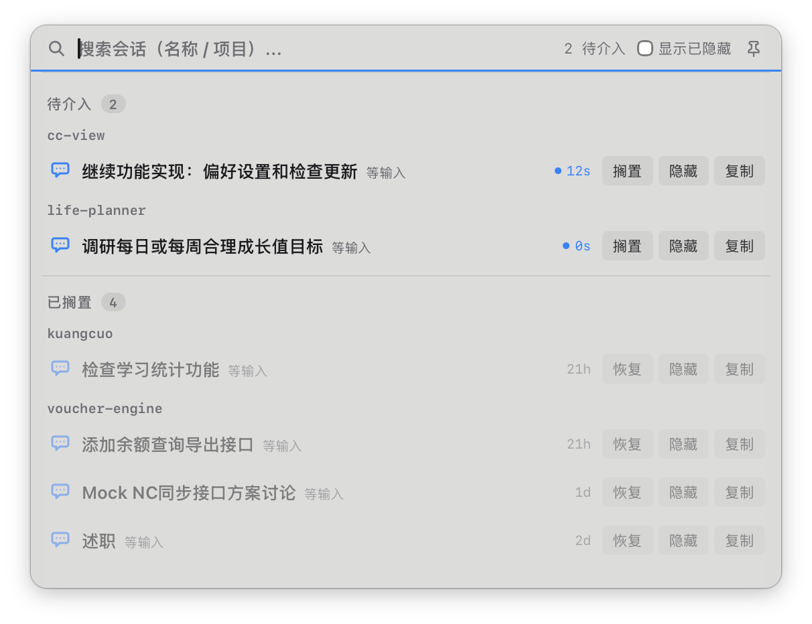
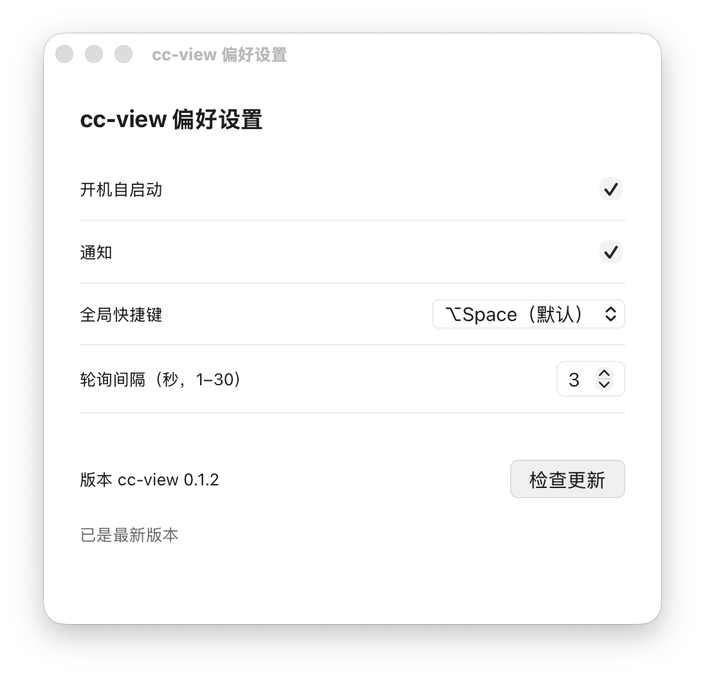

# cc-view

> 跨终端 Claude Code 会话状态总览 · macOS menubar

并行开多个 Claude Code 终端会话时，状态散落在各 tab / 窗口——哪个在干活、哪个等你回复 / 权限、哪个已经 idle，得逐个切窗口看。容易漏掉阻塞：一个 claude 等你确认权限 10 分钟你没注意，它就干等。

cc-view 把所有会话聚合到 **menubar 一个图标**（hover 看「N 等我 · M 工作」，需介入时变橙 + 红圆数字）+ **⌥Space 命令面板**（搜索 / focus 跳终端 / 搁置 / 隐藏 / 复制 ID，失焦收起）+ 系统通知——不用切窗口就能掌握全部会话、快速跳到要处理的那个。

## 截图

**命令面板（⌥Space 呼出）**



**偏好设置**



## 功能

- **⌥Space 命令面板**：全局快捷键呼出居中 overlay，搜索 / 聚焦 / 搁置 / 隐藏 / 复制 ID；失焦自动收起，可图钉钉住；位置记忆，拖动后持久化恢复。
- **menubar 聚合图标**：tooltip「N 等我 · M 工作 / 等权限 / 等回答」；有 NeedsPermission / WaitingForReply 时图标染橙 + 红圆数字 badge。
- **会话状态**：运行中 / 等输入 / 等权限 / Shell 模式 / Compacting；已退出会话置灰。3s 轮询，内容 hash 去重（状态不变不刷屏）。
- **系统通知**：会话进入「等权限 / 等输入 / 需要关注」时弹通知，按会话名区分（可在偏好关闭）。
- **搁置 / 归档**：搁置 = 暂时不管（不催促、不通知）；归档 = 收起不常看的会话（持久化，可恢复）。
- **闲置降级**：等输入超 30min 自动灰显 + 标「闲置」，全闲置项目整组下沉；超时等回答同样灰显——不抢注意力。
- **focus 跳转**：点会话行 activate 宿主终端 app（基于进程树回溯 + 点 Dock 图标切全屏 Space，需辅助功能权限）。
- **偏好设置**：开机自启动 / 通知开关 / 全局快捷键（⌥Space / ⌘⌥Space / ⌃Space / 禁用）/ 轮询间隔（1–30s）。
- **检查更新**：基于 tauri-plugin-updater，GitHub Releases 自动检查 + 下载安装 + 重启。

## 安装

1. 下载最新 [release dmg](https://github.com/Ethanzyc/cc-view/releases/latest)（`cc-view_<ver>_aarch64.dmg`）。
2. 打开 dmg，拖 cc-view 到 **Applications**。
3. 启动 cc-view——menubar 出现图标（平时无 dock 图标），⌥Space 呼出命令面板。

**要求**：macOS 13+，Apple Silicon（aarch64）。首次运行在系统设置里授权：通知（系统通知）、辅助功能（focus 跳全屏 app）。

## 数据源

cc-view 聚合多路数据源拼出最准确的会话视图：

- `~/.claude/sessions/<pid>.json`：前台交互会话状态。
- roster / 后台 agent 会话列表。
- `claude agents --json`：fleet agent 精确状态（运行中 / 等输入 / 等权限）。
- JSONL 尾部文本：等权限预测 + Compacting 检测（识别 `compact_boundary`）。

## 开发

```bash
npm install
npm run tauri dev     # 开发
npm run tauri build   # 产出 .app / dmg / updater artifacts
```

**技术栈**：Tauri 2（Rust）+ Vue 3 + TypeScript。后端每 3s 采集 → 状态机 reduce → 通知 → hash 去重 → emit `sessions` 事件；前端 Vue 监听渲染。设计文档与实现计划见 [docs/superpowers/](docs/superpowers/)。

## 已知限制

- **精细 focus**：点击会话行 activate 宿主终端 app（Terminal / iTerm / Ghostty / Otty …），尚未精确到 tab / pane。同 app 多会话仍需手动切 tab。
- **Compacting 检测为 post-compact**：通过 JSONL 末尾 `compact_boundary` 标记判定——这是 compaction **完成**后写入的。compaction 进行中的 ~2min 内 JSONL 无写入，无法实时检测。
- **updater 依赖网络**：检查更新走 `github.com`，网络不可达时报错（中文提示），需 GitHub 可达或代理。

## Recommended IDE Setup

[VS Code](https://code.visualstudio.com/) + [Vue - Official](https://marketplace.visualstudio.com/items?itemName=Vue.volar) + [Tauri](https://marketplace.visualstudio.com/items?itemName=tauri-apps.tauri-vscode) + [rust-analyzer](https://marketplace.visualstudio.com/items?itemName=rust-lang.rust-analyzer)

---

MIT
